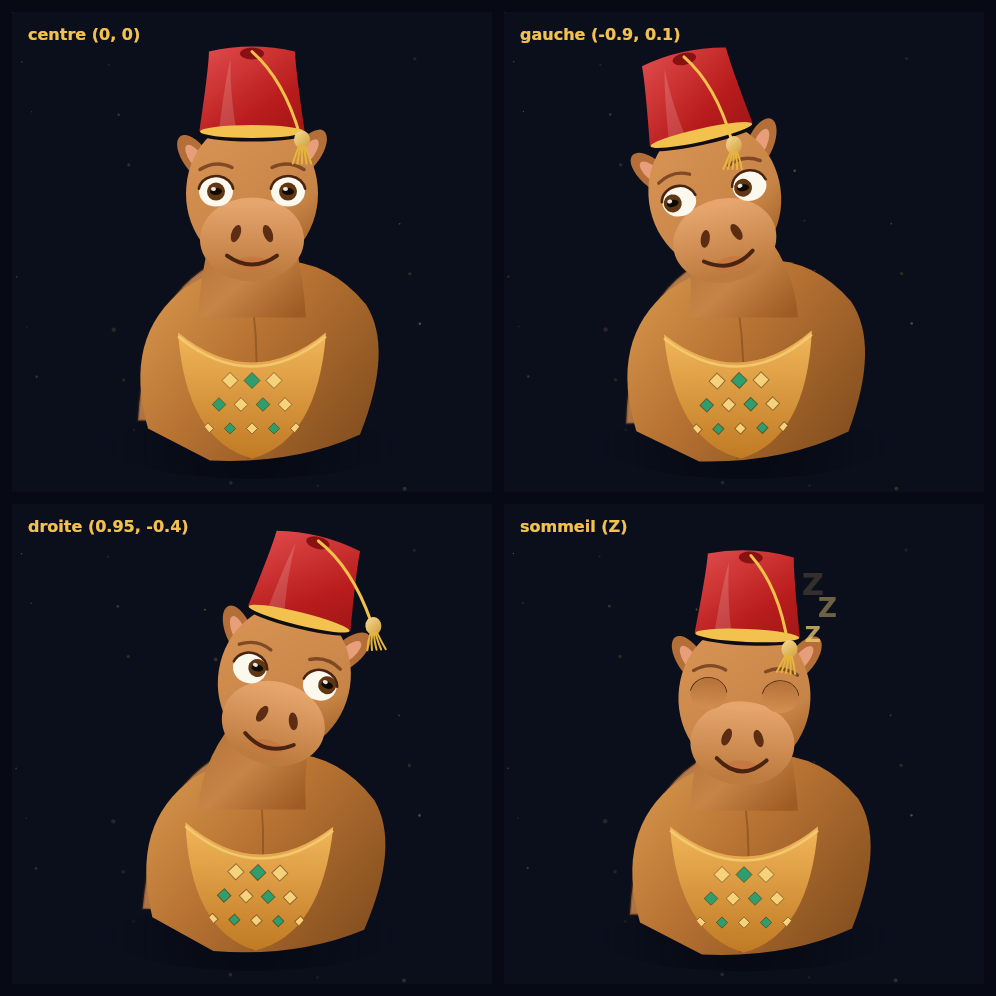

# LUXORA MA — 360° 🐪🍵

موقع **لوكسورا** (صناعة مغربية أصيلة) مع **الجمل المغربي بالطربوش** لي كايتبع الماوس، و **كاس أتاي بالنعناع** كمؤشر مخصص.

> الملف الأصلي لي تعطى كان **مقطوع** ف الوسط (داخل حلقة رسم الجفون). تم إكمال الجزء الناقص
> (فيزياء الشوشية، حلقة الرسم RAF، النعاس، الزوابع…) و إعادة هيكلة المحرك باش يبقى قابل للاختبار.



---

## البدء

```bash
npm install
npm run dev      # http://localhost:3000
```

```bash
npm run build && npm start   # نسخة الإنتاج
npm run typecheck            # فحص TypeScript
```

> السيرفر كايسمع على `0.0.0.0` و `allowedDevOrigins` مفتوح للـ preview proxies (e2b / surge).

---

## شنو كاين

| الملف | الوصف |
| --- | --- |
| `lib/jmal-draw.ts` | **محرك الرسم** — دالة نقية `drawJmal(ctx, w, h, frame)` بلا React: السنام، الجلابة، الزواقة الأمازيغية، الطربوش + الشوشية، الرمل، الزوابع `Z`. |
| `components/luxora-jmal.tsx` | `CustomCursor` (كاس أتاي بالنعناع) + `CharacterCanvas` (Gaze Engine + الفيزياء + RAF). |
| `components/gaze-panel.tsx` | الجمل + لوحة `GAZE ENGINE` (الزاوية / المسافة / الإطار). الـ state محصور هنا باش الصفحة ما تعاودش ترندر. |
| `app/page.tsx` | الصفحة: هيرو، marquee المدن، الحرفة، الضيافة 360°، تواصل. |
| `tools/render-preview.mjs` | رندر الجمل ف Node بلا متصفح (شوف تحت). |

### الشوفان 360° (Gaze Engine)

- `computeGazeVector` — زاوية + مسافة من مركز الراس، مع **منطقة ميتة** (24px) و **clamp** على `0.7 × أكبر بعد للشاشة`.
- `stepToward` / `shortestDelta` — دوران الراس على **7 إطارات (قطاعات)** بأقصر طريق (`HEAD_TURN_FRAMES`).
- `CharacterCanvas` — كلشي بالـ refs + `requestAnimationFrame` **واحد**: بلا re-render ف كل حركة ماوس.
- `IntersectionObserver` — الرسم كايوقف ملّي الجمل خارج الشاشة.

### فيزياء الشوشية (Tarbouche Physics)

نابض مخمّد على محور العقدة فوق الطربوش: `velocity += ΔheadAngle × 7.5`، `target = −0.55 × headAngle`،
تخميد `0.9^dt`، و clamp ف `±0.95 rad`. النتيجة: الشوشية كاتبقى مورا الحركة (lag) و كاترجع بحركة مرتدة.

### الرمش و النعاس

- رمش طبيعي كل 2.2 – 5.8 ثانية (الجفن كايهبط من الفوق داخل `clip` ديال العين).
- من بعد **7 ثواني** بلا حركة: العين كاتسد، الفم كايهبط، و `Z` كايبداو يطيرو — وأي حركة كايفيقو.

### المؤشر المخصص

- على الأجهزة بالماوس فقط (`hover: none` / `pointer: coarse` كايخلي المؤشر الأصلي).
- `body.luxora-cursor-hidden` كايخفي المؤشر الأصلي، و الكاس كايتأخر شوية (lag 0.18) + tilt حسب السرعة،
  و كايكبر فوق العناصر التفاعلية (`button, a, input, [role="button"], .interactive`).

---

## رندر الجمل بلا متصفح

```bash
npm i --no-save @napi-rs/canvas
node tools/render-preview.mjs docs/jmal-preview.png
```

كاتستعمل **نفس** `lib/jmal-draw.ts` — يعني أي تعديل ف الرسم كايبان ف اللوحة ديال الـ 4 حالات
(الوسط، اليسار، اليمين، النعاس). كايحتاج Node ≥ 22.18 (type stripping).

---

## ملاحظات

- كل الأرقام (المدن، الإيميل، التيليفون، الإحصائيات) **placeholders** — بدلهم بالمعطيات الحقيقية.
- الخطوط (Tajawal / Amiri) كايتحملو من Google Fonts ف `app/layout.tsx`.
- التصميم RTL (`dir="rtl"`, `lang="ar"`).
